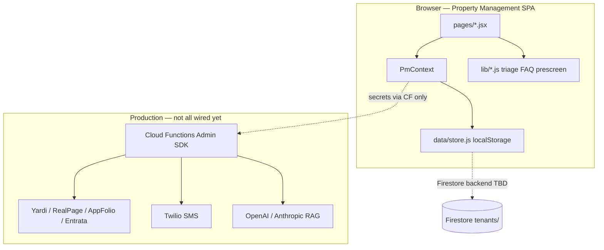

# Architecture & Data Flow

## Request lifecycle (high level)

## Multi-tenancy

- **Tenant ID:** `APP_CONFIG.defaultTenantId` from `VITE_PM_DEFAULT_TENANT` (default `demo`).
- **Storage keys:** `pm:{tenantId}:{collection}` in localStorage.
- **Firestore layout** (when enabled): `tenants/{tenantId}/residents|workOrders|...` — see `FIREBASE_SETUP.md`.

Each property management company is one tenant. Feature flags and per-feature `config` live on `settings.features` in the store.

## Feature registry pattern

`config/featureRegistry.js` declares every nav item and tunable:

- `enabled` — show/hide nav (except `locked` features)
- `config` — per-feature object merged into `featureMap.{id}.config`

Example: maintenance reads `featureMap.maintenance.config` for `selfHelpDeflection` and `emergencyAlerts`.

**To add a feature:** add registry entry + page + route in `PAGE_MAP` in `index.jsx`.

## Integration manifest pattern

`integrations/registry.js` defines providers. `SetupWizard.jsx` renders forms from manifests. Secrets are **never** persisted client-side in production design — only `integrations/{id}` status in store.

## AI-ready interfaces (swap backends here)

| File | Function | Replace with |
|------|----------|--------------|
| `lib/faqEngine.js` | `answerInquiry()` | LLM + vector search over `knowledge` collection |
| `lib/maintenanceTriage.js` | `triageRequest()` | LLM + optional vision on photos |
| `lib/prescreen.js` | `prescreenApplicant()` | TransUnion SmartMove API |

Callers (`Communications.jsx`, `Maintenance.jsx`, `Leasing.jsx`) stay unchanged if you preserve return shapes.

## Host site boundary

MacroREI marketing site and Map CMS (`/app/*`) are separate. Property management Firebase (`VITE_PM_FIREBASE_*`) is intentionally isolated from host `VITE_FIREBASE_*` to avoid data collision.
